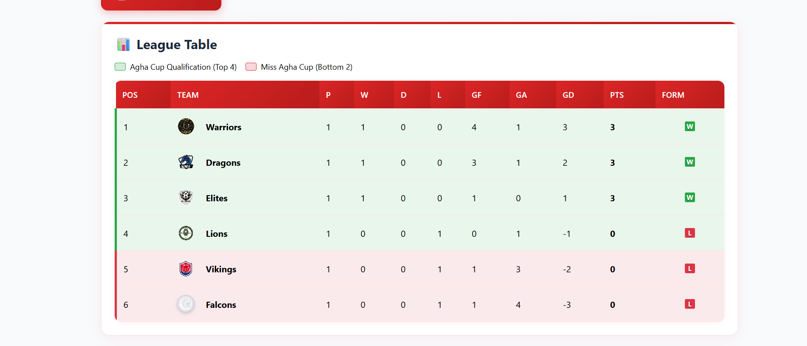
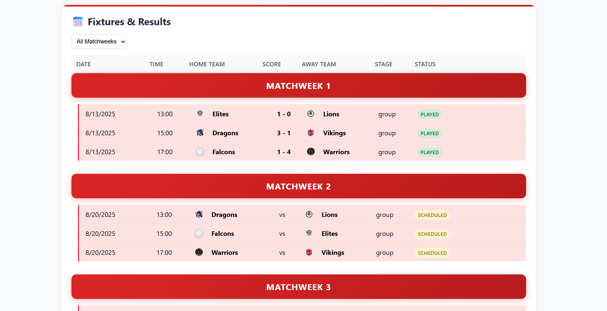
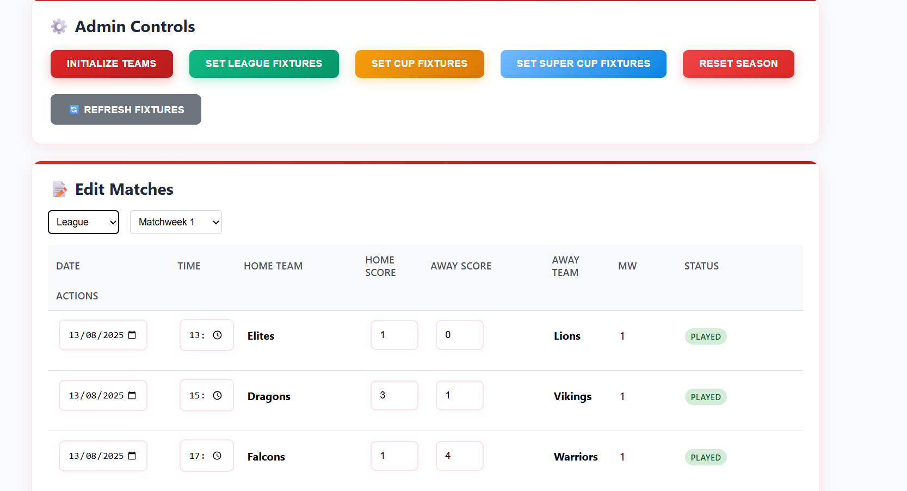
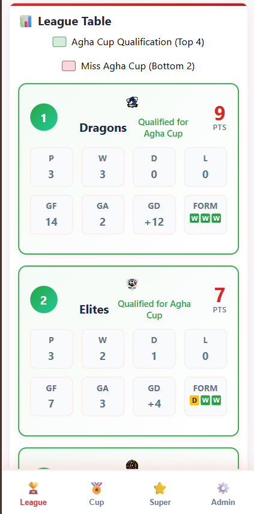
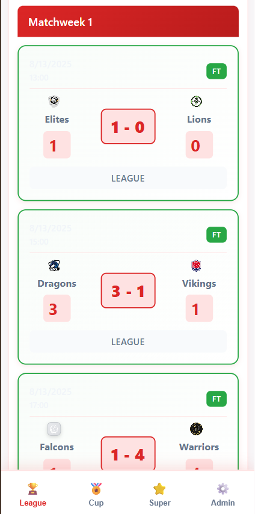

# League Scheduler

A comprehensive web application for managing a school's football league system with MongoDB + Express backend and React frontend.

## Screenshots

### Desktop View




### Mobile View (Coming Soon)



## Features

### Admin Panel
- **Set League Fixtures**: Generate home and away fixtures for 6 teams (10 matchweeks total)
- **Set Cup Fixtures**: Create knockout tournament for top 4 teams (semifinals and final)
- **Set Super Cup Fixture**: League winner vs cup winner
- **Edit Matches**: Update scores, dates, and times for all matches
- **Reset Season**: Clear all data and start fresh

### User View
- **League Table**: Real-time standings with points, goals, and statistics
- **Fixtures & Results**: View all matches with filtering options
- **Winner Banners**: Congratulatory messages when competitions are won

## Technology Stack

- **Backend**: Node.js, Express.js, MongoDB, Mongoose
- **Frontend**: React, Axios
- **Database**: MongoDB

## Quick Start

### Prerequisites
- Node.js (v14 or higher)
- MongoDB (local installation or MongoDB Atlas)

### Installation

1. **Clone the repository**
   ```bash
   git clone <your-repo-url>
   cd League-Scheduler
   ```

2. **Setup Backend**
   ```bash
   cd backend
   npm install
   cp .env.example .env
   # Edit .env with your MongoDB connection string
   npm run dev
   ```

3. **Setup Frontend**
   ```bash
   cd frontend
   npm install
   npm start
   ```

4. **Initialize Data**
   - Go to Admin Panel
   - Click "Initialize Teams" to create default teams
   - Click "Set League Fixtures" to generate the league schedule
   - Click "Set Cup Fixtures" to create cup matches

## API Endpoints

### Teams
- `GET /api/teams` - Get all teams with league table data
- `POST /api/teams` - Create a new team
- `POST /api/teams/initialize` - Initialize default teams

### Matches
- `GET /api/matches` - Get matches (with filtering)
- `POST /api/matches` - Create a new match
- `PUT /api/matches/:id` - Update match details
- `POST /api/matches/generate-league` - Generate league fixtures
- `POST /api/matches/generate-cup` - Generate cup fixtures

### Competitions
- `GET /api/competitions` - Get competition data
- `POST /api/competitions/reset-season` - Reset all data
- `POST /api/competitions/check-winners` - Check and update winners

## League System

- **6 Teams**: Vikings, Warriors, Lions, Elites, Falcons
- **League**: Double round-robin (home and away)
- **Cup**: Top 4 teams in knockout format
- **Super Cup**: League winner vs Cup winner

## Development

### Backend Development
```bash
cd backend
npm run dev  # Starts with nodemon for auto-restart
```

### Frontend Development
```bash
cd frontend
npm start  # Starts development server
```

## Contributing

1. Fork the repository
2. Create a feature branch
3. Make your changes
4. Test thoroughly
5. Submit a pull request

## License

MIT License