# ACity League System

A full-stack web application for managing a school football league — fixtures, live match tracking, standings, player statistics, multi-competition support, season archives, and an integrated fantasy football game (ACFPL). Built with React, Node.js, Express, and MongoDB.

**Live demo:** [https://league-scheduler-bqav.vercel.app/](https://league-scheduler-bqav.vercel.app/)

---

## Screenshots

### Desktop

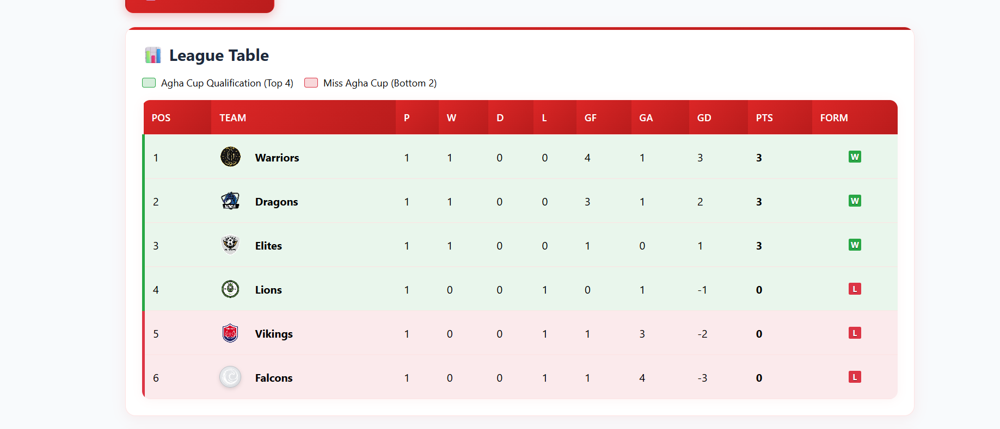

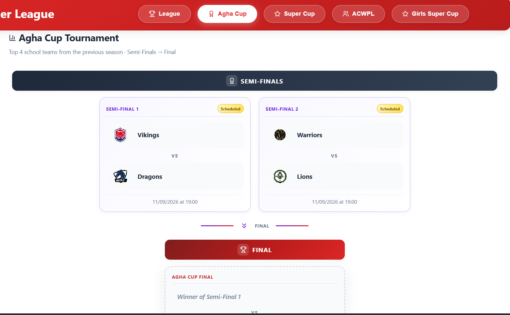


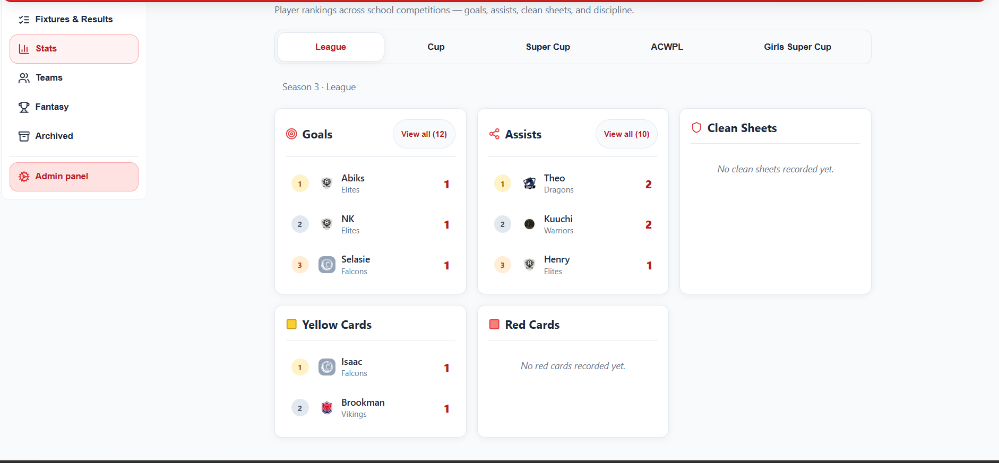

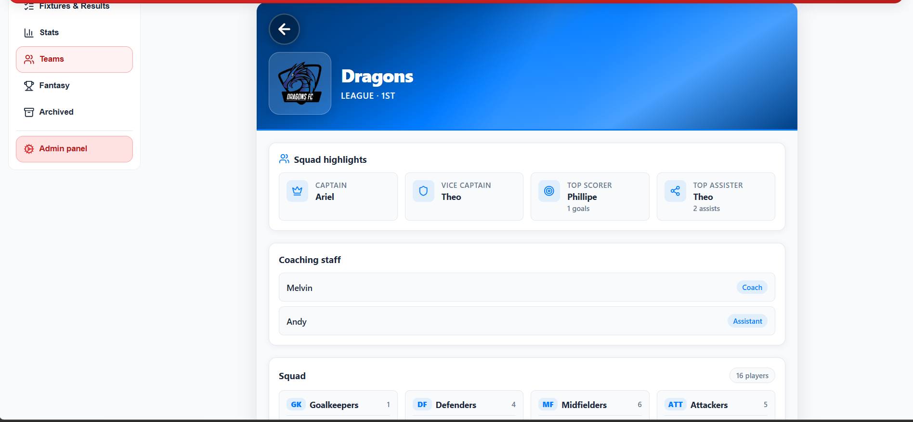

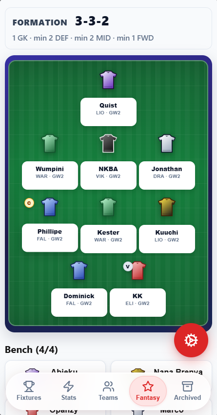

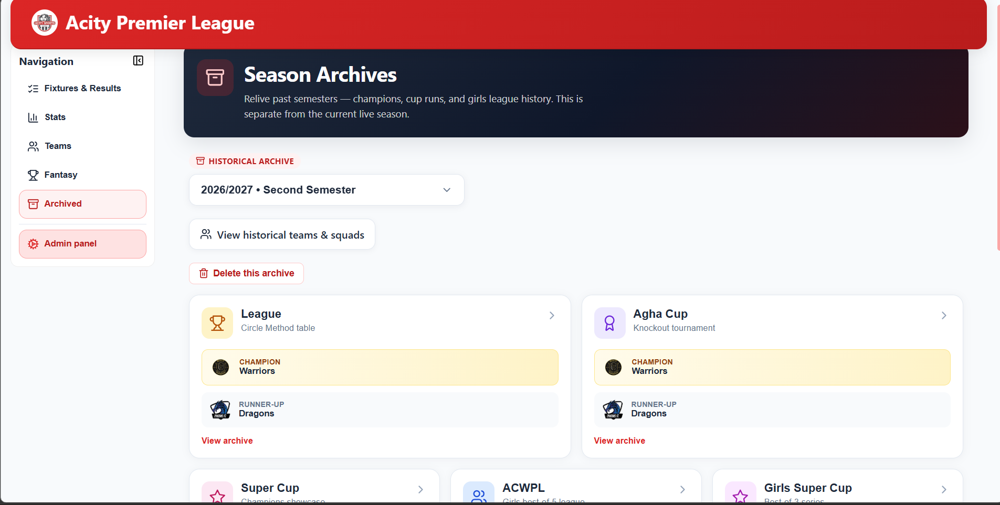

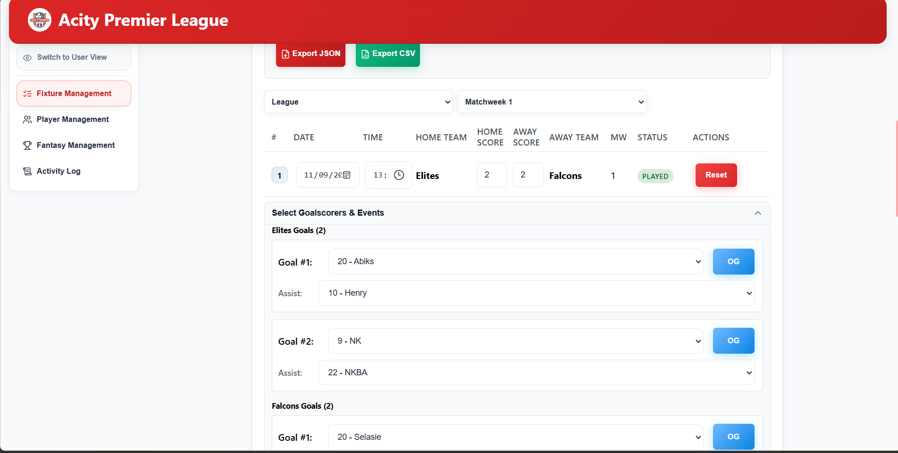

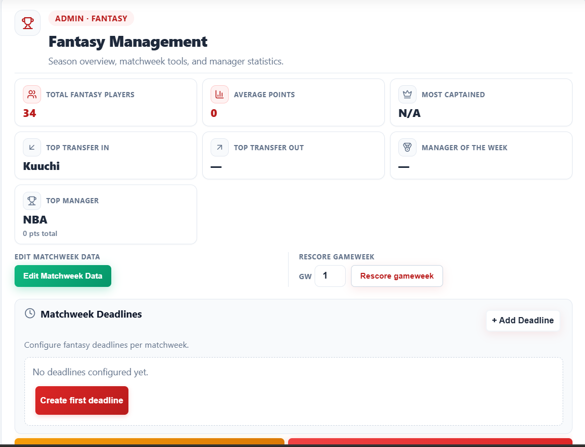

### Mobile

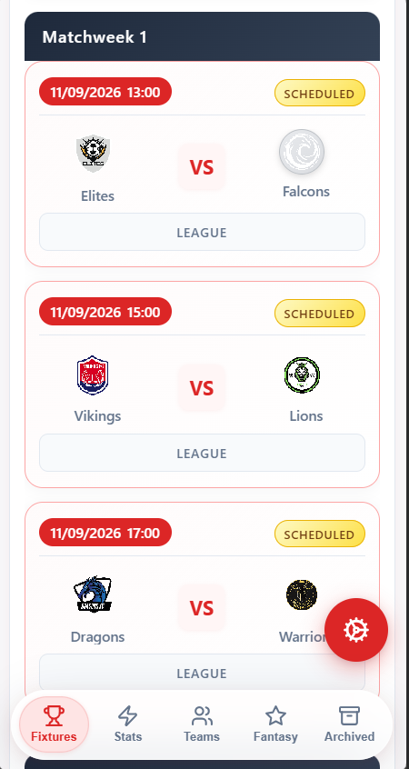

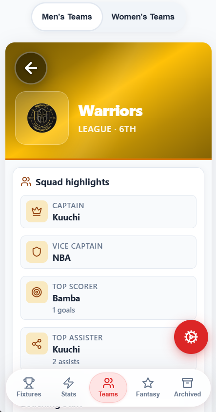

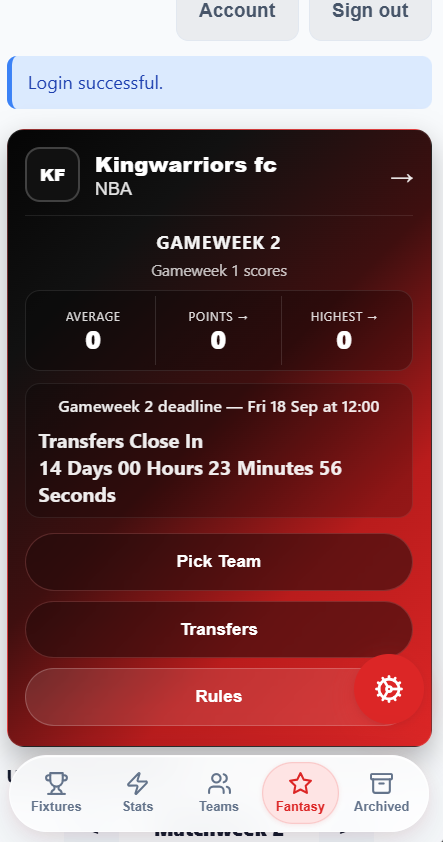

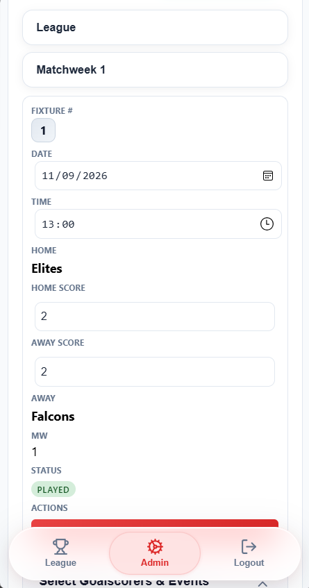

---

## Features

### Competitions

Five competition types are managed from a single app, each with dedicated UI styling:

| Competition | Format | Notes |
|-------------|--------|-------|
| **Men's League** | 6-team double round-robin | 30 fixtures across 10 matchweeks; randomized circle-method scheduling |
| **Agha Cup** | Top-4 knockout | Semi-finals and final; penalty shootout support on draws |
| **Super Cup** | Single match | League winner vs cup winner (with double-winner fallback logic) |
| **ACWPL** | Women's best-of-5 series | Orion vs Firestorm; early clinch voids remaining fixtures |
| **Girls Super Cup** | Women's best-of-3 bracket | Clinch-at-2-wins logic with bracket visualization |

### User View

- **Fixtures & Results** — Filter by competition and matchweek; expandable match cards with lineups, events, and live status badges
- **League Table** — Real-time standings with points, goals, and tiebreakers
- **Stats** — Per-competition leaderboards (goals, assists, clean sheets, cards)
- **Teams** — Men's and women's team toggles; browse squads, staff, and team details
- **Archived Seasons** — Browse frozen snapshots from past seasons (standings, fixtures, scorers, team pages)
- **Winner Banners** — Congratulatory banners when competitions are decided

### Live Match Tracking

- Match lifecycle: **Scheduled → Live → Full Time**
- Rich event entry: goals (with assists and own goals), yellow/red cards, clean sheets, minutes
- Starting lineups (9-player formations with position constraints)
- Match results cascade automatically into league tables, player stats, and fantasy scoring

### Fantasy — ACFPL (Acity Fantasy Premier League)

Integrated fantasy football powered by real league match data:

- **Account** — Register, email verification, login, password reset, profile edit, account deletion
- **Squad** — 13 players (2 GK, 4 DEF, 4 MF, 3 ATT); AC 100.0m budget; max 3 players per real club
- **Pick Team** — Custom **8+1 starting lineup** (1 GK + 8 outfield); captain, vice-captain, bench order
- **Scoring** — Position-weighted points from real fixtures (goals, assists, minutes, clean sheets, cards, bonus/special points)
- **Transfers** — Free-transfer banking (up to 2), −4pt hits for extra transfers
- **Chips** — Wildcard, Free Hit, Bench Boost, Triple Captain, Duo Captain
- **Auto-substitutions** — Bench players replace non-playing starters after gameweek lock
- **Overall League** — Rankings across 10 gameweeks
- **Acity Cup** — 32-manager knockout bracket (R32 through Final, GW6–10)
- **Manager profiles** — Multi-season history and season achievements

### Admin Panel

Four admin areas accessible via sidebar navigation:

1. **Fixture Management** — Generate, publish, and edit fixtures for all competitions; live match controls; goalscorer and event entry; season reset workflow with academic-year tagging
2. **Player Management** — CRUD for players; inter-team transfers; deletion preview (impact on stats and matches)
3. **Fantasy Management** — Set player prices, enter minutes/bonus/special points, set gameweek deadlines, rescore gameweeks, dashboard stats
4. **Activity Log** — Audit trail of 30+ admin action types

Additional admin capabilities:

- Initialize default teams and generate fixtures (league, cup, super cup, ACWPL, girls super cup)
- Publish/reset fixture drafts before going live to users
- Recalculate league table; check and update competition winners
- Archive-and-reset season (preserves frozen snapshot, clears active data)
- Switch between admin and user views; mobile admin FAB shortcut

### Security

- **Dual authentication** — Separate JWT systems for admin (email whitelist) and fantasy users
- **Password hashing** — bcryptjs for all stored passwords
- **Email flows** — Verification codes and password reset links via SMTP (nodemailer)
- **Production hardening** — Helmet headers, HTTPS redirect, CORS origin allowlist, startup validation
- **Audit logging** — Admin actions recorded with timestamps and details

### Mobile

- Mobile-first responsive design with bottom navigation
- Card-based layouts for league tables, fixtures, cup brackets, and archived data
- Touch-friendly competition tabs and expandable fixture cards
- Full admin functionality accessible on mobile devices

---

## Technology Stack

| Layer | Technologies |
|-------|-------------|
| **Frontend** | React 18, React Router v6, Axios, lucide-react, Create React App |
| **Backend** | Node.js, Express.js, Mongoose |
| **Database** | MongoDB (Atlas in production) |
| **Auth** | JWT (separate admin + fantasy secrets), bcryptjs |
| **Email** | nodemailer (SMTP) |
| **Security** | Helmet, CORS, email whitelist |
| **Testing** | 35+ unit test files (backend fantasy scoring, season archive, squad validation, transfers, etc.) |

---

## Deployment

**Live demo:** [https://league-scheduler-bqav.vercel.app/](https://league-scheduler-bqav.vercel.app/)

For full deployment instructions, see [DEPLOYMENT_GUIDE.md](DEPLOYMENT_GUIDE.md).

### Production Stack

| Service | Provider |
|---------|----------|
| Frontend | Vercel |
| Backend | Render |
| Database | MongoDB Atlas |

Free tiers are available for all three services.

---

## League System Overview

### Men's League

- **6 teams:** Dragons, Vikings, Warriors, Lions, Elites, Falcons
- **Format:** Double round-robin (home and away), 30 matches, 10 matchweeks
- **Scheduling:** Randomized circle method with shuffled match order

### Cup & Super Cup

- **Agha Cup:** Top 4 from the league table; semi-finals and final
- **Super Cup:** League winner vs cup winner

### Women's Competitions

- **ACWPL:** Best-of-5 series (Orion vs Firestorm)
- **Girls Super Cup:** Best-of-3 bracket

---

## API Overview

Routes are grouped under `/api/`:

| Route prefix | Purpose |
|--------------|---------|
| `/api/auth` | Admin authentication, password reset |
| `/api/fantasy/auth` | Fantasy user register, verify, login, profile, account deletion |
| `/api/teams` | Team CRUD, initialization, staff management |
| `/api/players` | Player CRUD, transfers, deletion preview |
| `/api/matches` | Fixture generation, live match controls, events, scores |
| `/api/competitions` | Competition state, winner detection |
| `/api/seasons` | Season archive, reset, reconcile |
| `/api/stats` | Player and team statistics |
| `/api/fantasy` | Squads, lineups, chips, overall league, Acity Cup |
| `/api/fantasy/admin` | Fantasy admin (prices, minutes, bonus, rescore, deadlines) |
| `/api/admin-activity` | Audit log |

---

## Project Structure

```
League-Scheduler/
├── backend/
│   ├── models/          # Mongoose schemas (22 models)
│   ├── routes/          # Express route handlers
│   ├── utils/           # Business logic, scoring, validation, tests
│   ├── middleware/      # Auth middleware (admin + fantasy)
│   └── server.js
├── frontend/
│   ├── src/
│   │   ├── components/  # UI components (~50+)
│   │   ├── pages/       # Archived season pages
│   │   ├── utils/       # Client-side helpers and tests
│   │   └── styles/      # CSS modules per feature area
│   └── public/
├── screenshots/         # README screenshot assets
├── DEPLOYMENT_GUIDE.md
└── README.md
```
